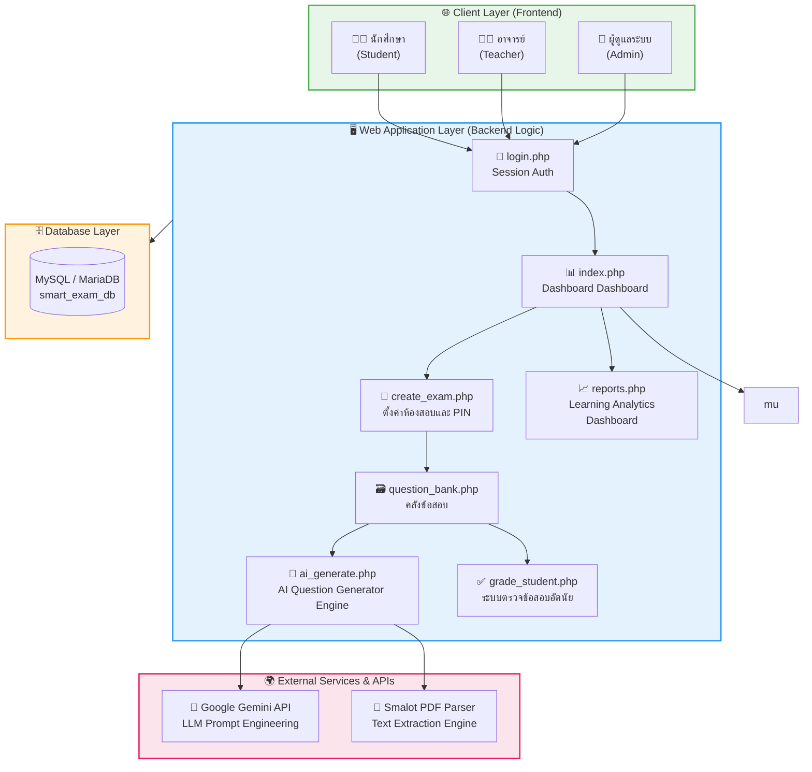

# ระบบบริหารจัดการการสอบอัจฉริยะ (Smart Exam Management System)

เว็บแอปพลิเคชันนวัตกรรมเพื่อการบริหารจัดการจัดสอบและการประเมินผลทางการศึกษาเชิงลึก บูรณาการร่วมกับเทคโนโลยีปัญญาประดิษฐ์ (Generative AI) เพื่อช่วยอำนวยความสะดวกในการสร้างคลังข้อสอบ ลดภาระงานของผู้สอน และยกระดับการวัดและประเมินผลทางการศึกษาด้วยโมเดลสถิติขั้นสูง

## 🌟 จุดเด่นและฟีเจอร์หลัก (Core Features)

* **ระบบสิทธิ์การเข้าใช้งานแบบแบ่งระดับ (Role-Based Access Control):** แยกแยะการทำงานอย่างรัดกุมระหว่าง ผู้ดูแลระบบ (Admin), อาจารย์ผู้สอน (Teacher) และนักศึกษา (Student)
* **เครื่องมือสร้างข้อสอบอัจฉริยะด้วย AI (AI-Powered Question Generator):** ทำงานร่วมกับ Google Gemini API (`gemini-3.1-flash-lite`) ในการสกัดใจความสำคัญจากสื่อการสอน หรือเอกสารที่อัปโหลดผ่านสถาปัตยกรรมสกัดข้อมูลจากไฟล์ PDF (PDF Parser Library) เพื่อนำมาสร้างโครงร่างข้อสอบปรนัยและอัตนัยโดยอัตโนมัติ
* **ระบบคลังข้อสอบส่วนกลาง (Centralized Question Bank):** อาจารย์สามารถจัดหมวดหมู่ ค้นหา แยกตามปีการศึกษา และดึงข้อสอบเก่ามาจัดเป็นชุดทดสอบใหม่ได้อย่างเป็นระบบ
* **ระบบจัดสอบและควบคุมความปลอดภัยเสถียรสูง (Secure Examination Engine):** ระบบล็อกเข้าห้องสอบด้วย PIN 6 หลัก, ระบบนับถอยหลังเวลาสอบแบบเรียลไทม์ (Session Timer) และระบบป้องกันข้อมูลสูญหายด้วย Auto-save LocalStorage
* **ระบบวิเคราะห์คุณภาพข้อสอบ (Learning Analytics & Item Analysis):** ประมวลผลทางสถิติหลังการสอบเสร็จสิ้นทันทีเพื่อคำนวณหาค่าความยากง่าย (Difficulty Index: $p$) และค่าอำนาจจำแนก (Discrimination Index: $r$) รายข้อ ช่วยให้ผู้สอนคัดเลือกและปรับปรุงข้อสอบได้อย่างเป็นวิทยาศาสตร์

---

## 🏗️ สถาปัตยกรรมของระบบ (System Architecture)

ระบบถูกออกแบบภายใต้สถาปัตยกรรม Client-Server Model แยกส่วนการทำงานออกเป็น 3 ระดับเลเยอร์อย่างชัดเจน ดังนี้:



---

## 📁 โครงสร้างโปรเจกต์ (Project Directory Structure)

```text
Smart-Exam-Management-System/
├── config/
│   └── db.php                  # ไฟล์เชื่อมต่อฐานข้อมูลผ่านระบบ PDO Connection
├── css/
│   ├── sb-admin-2.css          # ไฟล์สไตล์สไลด์บาร์หลักของ SB Admin 2 เทมเพลต
│   └── sb-admin-2.min.css
├── includes/
│   ├── header.php              # โครงสร้างส่วนหัวและ CDN Assets หลัก
│   ├── sidebar.php             # เมนูควบคุมการเข้าถึงฟังก์ชันแยกตามสิทธิ์ (Roles)
│   ├── topbar.php              # ระบบแสดงข้อมูลบัญชีผู้ใช้และแจ้งเตือน
│   └── footer.php              # ข้อมูลเครดิตและสคริปต์ JavaScript หลัก
├── ai_generate.php             # ส่วนประมวลผล Prompt Engineering และเชื่อมต่อ Gemini API
├── auth_guard.php              # ระบบตรวจสอบสิทธิ์และป้องกัน Security Session Bypass
├── create_exam.php             # หน้าจัดชุดทดสอบ กำหนด PIN และตั้งค่าเวลาเปิด-ปิดระบบสอบ
├── exam_results.php            # สรุปภาพรวมและประวัติคะแนนของห้องสอบรายห้อง
├── grade_student.php           # หน้าประเมินผลและให้คะแนนในส่วนของข้อสอบอัตนัย (Manual Grading)
├── index.php                   # หน้าแสดงแดชบอร์ดหลักของแต่ละสิทธิ์ผู้ใช้งาน (Dashboard Control)
├── item_analysis.php           # โมดูลวิเคราะห์ค่าสถิติความยากง่ายและความเที่ยงตรงของข้อสอบรายข้อ
├── join_exam.php               # หน้าสำหรับให้นักศึกษากรอก PIN 6 หลักเพื่อเข้าสอบ
├── login.php                   # ระบบพิสูจน์สิทธิ์และตรวจสอบความปลอดภัยการเข้าสู่ระบบ
├── logout.php                  # ระบบล้างทำลาย Session ข้อมูลเพื่อออกจากระบบอย่างปลอดภัย
├── manage_courses.php          # ส่วนจัดการเพิ่ม ลบ แก้ไข ข้อมูลรายวิชาของสิทธิ์แอดมิน
├── manage_questions.php        # ส่วนเขียนโจทย์คำถาม รูปแบบปรนัย-อัตนัยเข้าคลังข้อสอบแบบทำเอง
├── manage_users.php            # หน้าจัดการข้อมูลผู้ใช้งานและ Import รายชื่อนักศึกษาผ่านไฟล์ CSV
├── my_results.php              # หน้าแสดงประวัติและผลคะแนนสอบส่วนตัวของนักศึกษา
├── profile.php                 # การจัดการข้อมูลส่วนตัวและเปลี่ยนรหัสผ่านของผู้ใช้งาน
├── question_bank.php           # หน้ารวมคลังข้อสอบแยกวิชาหลักของสิทธิ์อาจารย์
├── reports.php                 # หน้ารายงานสถิติคะแนนเชิงวิเคราะห์และLearning Analytics สถิติห้องเรียน
├── take_exam.php               # หน้าต่างระบบทำข้อสอบออนไลน์ มีระบบจับเวลาและบันทึกคำตอบอัตโนมัติ
├── composer.json               # ไฟล์บริหารจัดการ Dependency Packages (Libraries) ของ PHP
└── README.md                   # เอกสารอธิบายระบบฉบับนี้
```

---

## 🛠️ เทคโนโลยีและเครื่องมือที่เลือกใช้ (Technology Stack)

* **Backend Developer Language:** PHP 7.4+ / PHP 8.x
* **Database Management System:** MySQL / MariaDB เชิงสัมพันธ์ (Relational Database)
* **Frontend Framework:** HTML5, CSS3, JavaScript (ES6+), Bootstrap 4 (SB Admin 2 เทมเพลต)
* **Package Manager:** Composer (PHP Dependency Manager)
* **Artificial Intelligence:** Google Gemini API Server Integration via RESTful API Architecture
* **Third-party Libraries:** Smalot PDF Parser (สำหรับดึง Text ออกจากไฟล์สื่อการสอนชนิด PDF)

---

## 🚀 ขั้นตอนการติดตั้งเพื่อทดสอบระบบ (Installation Guide)

### 1. การเตรียมระบบฐานข้อมูล
1. สมัครใช้งานพื้นที่จัดเก็บฐานข้อมูล หรือจำลองเซิร์ฟเวอร์ในเครื่องคอมพิวเตอร์ผ่านโปรแกรม **XAMPP / Laragon**
2. เข้าใช้งานระบบจัดการฐานข้อมูล **phpMyAdmin** จากนั้นคลิกสร้างฐานข้อมูลใหม่ขึ้นมา
3. ไปที่แท็บ **Import** เลือกคำสคริปต์โครงสร้าง SQL แล้วกดรันเพื่อจำลองโครงสร้างตารางข้อมูลทั้ง 8 ตารางหลักให้พร้อมใช้

### 2. การกำหนดค่าระบบและการเชื่อมต่อสคริปต์โค้ด
ให้เข้าแก้ไขไฟล์ตั้งค่าการเข้าถึงฐานข้อมูลในส่วนงานหลังบ้านที่ตำแหน่งไฟล์ `config/db.php` เพื่อเปลี่ยนตัวแปรค่าการเชื่อมต่อฐานข้อมูลระบบ PDO ให้ตรงกับพื้นที่โฮสติ้งจริงของคุณ:

```php
$host = 'ระบุที่อยู่ MySQL Host Name ของเซิร์ฟเวอร์';
$dbname = 'ระบุชื่อฐานข้อมูลของคุณ';
$user = 'ระบุชื่อผู้ใช้งานฐานข้อมูล';
$pass = 'ระบุรหัสผ่านเข้าใช้ฐานข้อมูล';
```

### 3. การติดตั้ง Dependencies เสริมสำหรับระบบประมวลผล PDF
เปิดโปรแกรม Command Line ในเครื่องคอมพิวเตอร์ของคุณแล้วเข้าไปที่โฟลเดอร์โปรเจกต์ จากนั้นรันคำสั่งด้านล่างนี้เพื่อดึง Dependencies เสริมเข้ามาติดตั้งในระบบอัตโนมัติ:

```bash
composer install
```

### 4. การเข้าใช้งานครั้งแรก (Initial Account Setup)

เมื่อแอปพลิเคชันทำงานและเชื่อมต่อกับฐานข้อมูลสำเร็จ ระบบจะมีตรรกะตรวจสอบผู้ใช้งานเริ่มต้นอัตโนมัติ (Automated Database Seeding) 

* **กรณีติดตั้งระบบใหม่ (ยังไม่มีข้อมูลแอดมินในตาราง users):** ระบบจะทำการสร้างบัญชีผู้ดูแลระบบสูงสุด (System Administrator) ลงในฐานข้อมูลให้โดยอัตโนมัติทันที เพื่อความสะดวกในการขนย้ายและติดตั้งบน Cloud Hosting
  * **ชื่อผู้ใช้งาน (Username):** `admin`
  * **รหัสผ่านเริ่มต้น (Password):** `admin123`
*(หมายเหตุ: เพื่อความปลอดภัยของระบบ ผู้ดูแลระบบควรเข้าสู่ระบบไปเปลี่ยนรหัสผ่านทันทีในการใช้งานครั้งแรก)*
